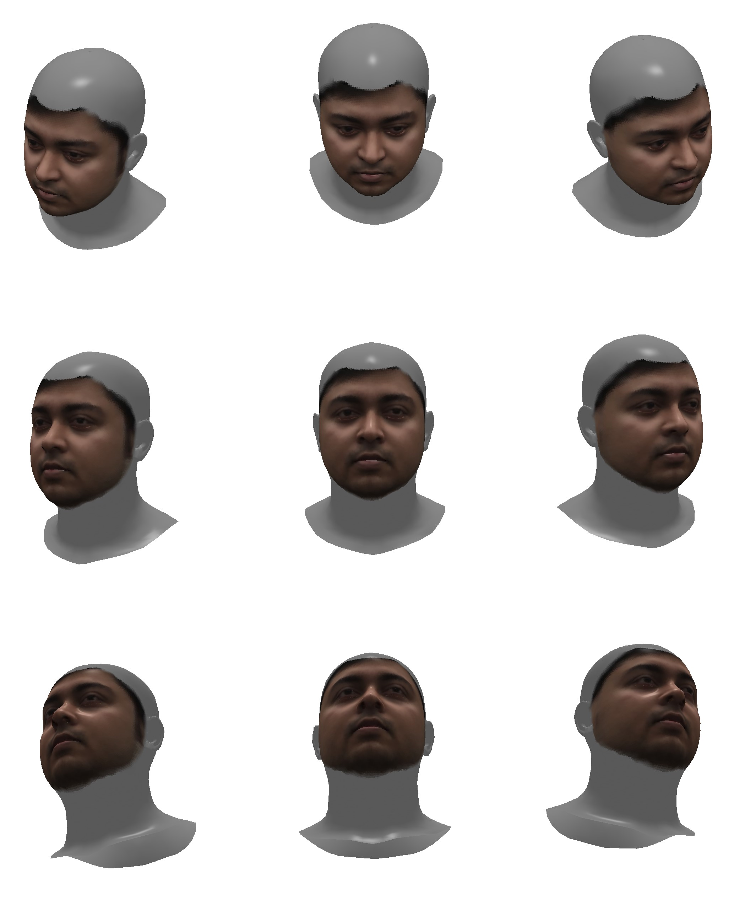

# Face Turner代码说明

## 环境配置

### python
该任务需要使用python实现，这里推荐使用python3.8.19。
操作系统需要Linux系统，Windows环境无法实现

### 依赖库
所需要的依赖库列在了requirement.txt当中，推荐使用Anaconda的虚拟环境安装。
在项目目录下打开命令行或者powershell，运行下面的命令即可安装依赖库。
```
pip install -r requirement.txt
```
本次作业依赖pytorch，最好使用cuda，因为真能明显加速！安装pytorch时务必注意带上cuda的。
注意，由于依赖项目的问题，使用的库并非最新版，需要安装11.7版的CUDA。

## 实现任务

### 作业描述

根据一张人脸图像，生成其不同姿态人脸图像

### 模型位置

构建人脸3D模型需要一个基准模型，本解决方案使用[Albedo model](https://github.com/TimoBolkart/BFM_to_FLAME)中的FLAME_albedo_from_BFM.npz模型，放置在./DECA/data目录下。如有需要，可以进行替换。


### 操作流程

1. 在turner下建立文件夹input，放入主要内容为人脸的图片（jpg/png）
2. 运行runner.py，注意输入待定参数```--conda_env=base```，把base替换为你的虚拟环境的名称
3. 即可在output文件夹中得到每张图片上下左右各正面/转30度/组合转30度的9张图片

- 如果本来就有.obj及配套的.mlt和纹理文件，也可以创建objs文件夹，在里边创建以obj的文件（除后缀名）命名的文件夹，并将这三个文件均放入该文件夹；然后在运行时再加参数```--obj_status=1```
- 如果想要调整图片的尺寸为2048×2048，暂不支持长宽不等的矩形（默认值为1024*1024），运行时再加参数```--image_size=2048```
- 如果感觉生成图像中人脸的比例太小，可以调整相机的水平场视角，该视角默认值为60°，为典型人眼视角；调整为30°可以让显示比例显著增大，注意只能为整数```--fov=30```
- 除了调整视角，调整相机与模型的远近也可以实现上述目的，距离是默认值为3，可以是小数，若想调整为1.5加入参数```--camera_dist=1.5```

- 完整命令```python runner.py --conda_env_name=【输入环境名】 --obj_status=【输入是否有完整obj信息】 --image_size=【想要的尺寸】 --fov=【水平场视角】```
- 一个例子```python runner.py --conda_env_name=deca3.8 --obj_status=0 --image_size=2048 --fov=30```

注：3D模型的构建与渲染均需要较多计算，默认值下，批处理9张图的9个视角约需2-5分钟

注：某些模型竟然是只给出背影，于是增设参数```--azim180=1```意为转身

## 实现效果展示



